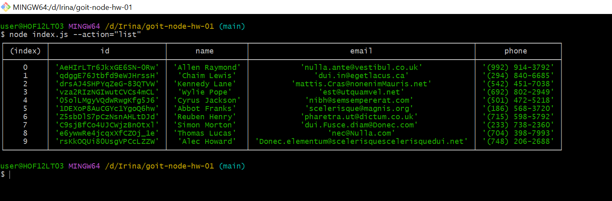

# goit-node-hw-01

### Отримання та виведення списку контактів

Для отримання та виведення всього списку контактів у вигляді таблиці виконайте наступну команду:  
**node index.js --action="list"**

[Посилання](https://monosnap.com/file/BBVmTT0kTQXoDswwGH7C4b3wo9Lkwp)

### Отримуємо контакт по id

Для того,щоб отримати контакт по id виконайте команду:  
**node index.js --action="get" --id 05olLMgyVQdWRwgKfg5J6**

[Посилання](https://monosnap.com/file/07vAUEiU1Hk8kvPU5wYIsmtsvJZM60)

### Додаємо контакт

Щоб додати новий контакт до phonebook потрібно виконати наступну команду
з новими даними (name,email,phone):  
**node index.js --action="add" --name Mango --email mango@gmail.com --phone 322-22-22**

[Посилання](https://monosnap.com/file/YUe6ChrtP7mjDCifR4sPTtBuYLfqnY)

### Видаляємо контакт

Для видалення потрібно вписати id в наступну команду:  
**node index.js --action="remove" --id qdggE76Jtbfd9eWJHrssH**

[Посилання](https://monosnap.com/file/wndXkiwgKDSAFBLNlI6SCum9y6OtpS)
